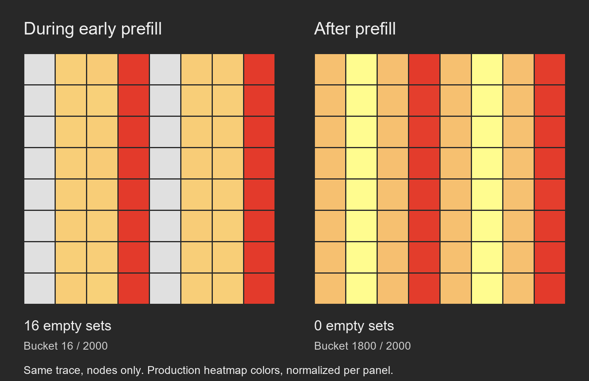

> Current Table 1 commands are in [the main guide](README.md#3-reproduce-table-1-performance-comparisons).
> The older performance commands and confirmation numbers in this reference
> document are historical; their static-SSMEM/whole-process-counter settings
> are not the phase-gated Table 1 entry point. EFRB figures use two workers;
> standalone EFRB Table 1 throughput uses four.

# Full configurations and reference

Return to the [step-by-step evaluator guide](README.md). Commands in that guide
select their stated configurations. The camera-ready README explicitly binds
EFRB/DVY memory to match its final campaign; the earlier confirmations below
retain single-node interleaving. This supplement preserves the full
configuration recipes, runtime and NUMA details, variant explanations, output
schemas, sampling rules and errata formerly interleaved with the README steps.
The evaluator confirmations below remain separate from the camera-ready campaign
and from the logging/PMU batches; no retained measurement has been replaced.

- [Explicit performance configurations](#explicit-performance-configurations)
- [Appendix figure and table index](#appendix-figure-and-table-index)
- [EFRB diagnostic variants](#efrb-diagnostic-variant-reference)
- [Requirements and runtimes](#requirements-and-runtimes)
- [GUI and small checks](#gui-and-small-benchmark-checks)
- [Before/after trace reference](#beforeafter-visualization)
- [Workloads, NUMA and allocators](#hardware-and-workloads)
- [HNSW attribution](#attribute-the-hnswlib-improvement)
- [Results and saved inputs](#find-and-interpret-results)
- [Sampling, traces and model-assisted analysis](#generate-traces-and-try-model-assisted-analysis)
- [C2 overhead](#reproduce-logging-overhead-c2)
- [Errata and configuration changes](#errata-and-updated-reproduction-configurations)

The [camera-ready reproduction guide](camera-ready-reproduction/README.md) adds
backend/UI/sampling commands, final campaign references, and controlled TPC-C
and HNSW factors. It preserves the distinction between recorded frozen sources
and timings on current artifact code.

## Explicit performance configurations

These are the standard paper-profile configurations selected by the main
README's commands and `all-performance --profile paper`. Flags written out
in the primary recipes make the defaults explicit; they are not extra tuning
steps. Alternative workloads and factorization commands are labelled separately.
Repetition counts are stated below (ten per variant unless specified).
Run from the repository root after building the Docker image.
Commands create a new timestamped directory under `artifact/results/` for each
invocation, so repeated campaigns do not require a fresh checkout.

## Standalone EFRB: four threads

```bash
HEAPLENS_NUMA=1 HEAPLENS_PERF=1 bash artifact/run.sh experiment ascylib_efrb_bench \
  --profile paper --threads 4 --initial 262144 --range 524288 \
  --duration-ms 5000 --update-pct 0 --reps 10 \
  --server-node 0 --memory-policy interleave
```

This default uses four physical cores on one socket, glibc backing, and the four
existing baseline/segregation/parallel-prefill/combined variants. On the
dual Xeon Gold 5220R machine, ten repetitions per variant gave a combined
gain of 29.62% (95% interval 28.45–31.13%); segregation alone gave 19.76%
and parallel prefill 21.83%. A separate duration comparison confirmed
29.82% at five seconds and 29.69% at ten seconds. Those batches are not pooled.
The historical four-thread result is 35.14%; the remaining gap is not erased
by this configuration correction. The retained script uses three-second
windows, whereas the paper describes five seconds; the default uses five.

The earlier eight-thread, five-second, strictly bound comparison remains
available with `--threads 8 --memory-policy bind`. It gave 27.24%
(26.61–27.89%), versus the historical eight-thread 25.38% result. Diagnostic
trace and instrumentation-overhead thread counts are separate experiments.

## DVY: equal huge-page advice for all node layouts

```bash
HEAPLENS_NUMA=1 HEAPLENS_PERF=1 bash artifact/run.sh experiment ascylib_dvy_bench \
  --profile paper --threads 8 --initial 1048576 --range 2097152 \
  --duration-ms 5000 --update-pct 0 --reps 10 \
  --server-node 0 --memory-policy interleave
```

The default requests transparent huge pages for **every** layout using a
corrected libc bundled in the Docker image, without upgrading the host or
changing any other benchmark's runtime. Both baseline and optimized nodes use
the same allocator/advice policy. Four separate full-workload diagnostic
processes record `smaps`; the following timing processes are unprobed.

`--dvy-hugepages require` makes the page-backing check mandatory. The default
`auto` warns and continues if the host cannot supply huge pages, or if an older
image lacks the runtime bundle. `--dvy-hugepages off` compares layouts with
allocator advice off under the same selected runtime; global THP `always`
can still supply huge pages. Runtime selection, versions and library hashes
are recorded in `runs/campaign.json`, and the backing check in
`runs/dvy-page-checks/summary.json`. Rebuild the image to obtain the supplied
runtime; no exact libc/compiler package version is required on the host.

On Pyke (dual Xeon Gold 5220R), this command's default configuration gave
17,467,000 ops/s for 96-B nodes and 20,683,600 ops/s for 192-B nodes:
**18.42%** improvement (paired-block bootstrap 95% interval **17.14–19.82%**),
compared with the historical 17.54%. All 40 trials were retained. These were
source builds using the artifact's GCC 11.4/O2, non-PIE and static SSMEM,
with the isolated libc 2.39 runtime. Separate mapping checks observed huge-page
backing for all four layouts. Hardware/kernel differences can change the gain.

## HJ: allocator comparison at 24 threads

```bash
HEAPLENS_NUMA=1 HEAPLENS_PERF=1 bash artifact/run.sh experiment ascylib_hj_bench \
  --profile paper --threads 24 --initial 1048576 --range 2097152 \
  --duration-ms 5000 --update-pct 0 --reps 10 --hj-jemalloc 5.3 \
  --server-node 0 --memory-policy bind
```

This compares glibc against retained jemalloc 5.3.0 with otherwise identical
settings. The dual Xeon Gold 5220R result was 5.46% higher mean throughput with
glibc (95% interval 2.19–9.02%). Variation is substantial: individual paired
changes ranged from -0.70% to +13.89%; all runs were retained. The default worker
count is 24, so the command without overrides and `all-performance` use this
configuration. The comparison defaults to jemalloc 5.3;
`--hj-jemalloc 5.0` preserves access to the initial artifact's jemalloc 5.0.1.
Allocator paths and hashes are recorded in `runs/campaign.json`.

## HNSW: dimension and huge-page placement

The 128-D and 1536-D before/after comparisons were confirmed on both the
dual Xeon Gold 5220R machine (kernel 6.8.0-137-generic) and a four-socket Xeon
Platinum 8160 machine (kernel 5.8.0-55-generic). Each uses 24 physical cores
and memory from one NUMA node, system libc, one million vectors,
100,000 indexed queries, 24 construction/query threads, M=16, ef_construction=200,
ef=64, k=10, 10,000 warmup queries, and five timed iterations (500,000 queries).

Run both dimensions with the default paper command:

```bash
HEAPLENS_NUMA=1 bash artifact/run.sh hnsw --profile paper
```

The corrected snapshot is already part of the artifact. Its vector-slab
huge-page advice precedes first touch. Both variants use that same snapshot,
with the layout/huge-page macros disabled for baseline. Ten blocks each contain
baseline and combined trials at both dimensions (40 processes total), alternating
dimension and variant order. Results remain separate by dimension. Add
`--dim 128` or `--dim 1536` to run just one. The original snapshot and 768-D
workload remain accessible with `--hnsw-source original --dim 768`.

| Dimension | Xeon Gold 5220R combined gain | 95% interval | Xeon Platinum 8160 combined gain | 95% interval |
|---:|---:|---:|---:|---:|
| 128 | +9.51% | 9.41–9.59% | +7.15% | 7.03–7.25% |
| 1536 | +6.56% | 6.44–6.68% | +6.17% | 6.05–6.29% |

All ten before/after pairs were positive at each dimension on both machines.
On the Xeon Gold 5220R, mean baseline/combined QPS were 66,340/72,650 at 128D
and 7,156/7,626 at 1536D, with within-variant coefficients of variation below 0.16%.

To measure all four combinations of layout changes and huge-page advice:

```bash
HEAPLENS_NUMA=1 bash artifact/run.sh hnsw-factorization --factors hugepage \
  --profile paper --dim 128 --threads 24 --reps 10 --server-node 0 --memory-policy bind

HEAPLENS_NUMA=1 bash artifact/run.sh hnsw-factorization --factors hugepage \
  --profile paper --dim 1536 --threads 24 --reps 10 --server-node 0 --memory-policy bind
```

The four-variant factor analysis below was measured on the Xeon Platinum 8160;
it does not decompose the Xeon Gold 5220R gains.

| Dimension | Layout alone | Huge pages alone | Combined | Combined 95% interval |
|---:|---:|---:|---:|---:|
| 128 | +0.73% | +2.35% | +7.15% | 7.03–7.25% |
| 1536 | +1.97% | +2.10% | +6.17% | 6.05–6.29% |

Layout here groups vector separation and 64-byte alignment. Separate mapping
diagnostics found more than 99.9% huge-page backing for the combined variant's
vector slabs and zero for baseline/layout-only index allocations. The timing
processes themselves were uninstrumented. These dimension-specific gains do
not establish the same gain at 768 dimensions: the Xeon Platinum 8160's fixed 768-D
comparison gave 1.87%. Multithreaded graph construction is nondeterministic.

## RocksDB HashSkipList: field reordering

```bash
HEAPLENS_NUMA=1 bash artifact/run.sh rocksdb --memtable prefix_hash --profile paper
```

The default uses 96 logical CPUs across NUMA nodes 0 and 1, including SMT,
with memory interleaved across the two nodes. There are 95 readers plus one
writer, 10M initial keys, 32-byte keys, 128-byte values, a 256-MiB write buffer,
and a 10-second read window after `filluniquerandom,waitforcompaction`.
WAL and synchronous writes are disabled; ordinary flushing, automatic
compaction, and shutdown flushing are enabled. The retained jemalloc 5.3
library and release/portable build are identical between variants; only the
existing `REORDER_FIELDS=1` option differs. `NO_PADDING_NODE` is not enabled.

`--rocks-nodes 2 3` selects another pair of NUMA nodes. CPU IDs are discovered
from the topology and allowed CPU set; `--threads` selects an even total count
distributed equally across the two nodes. Placement constrains the process's
CPU set, rather than pinning individual workers. Full runs save their SST files
and require tens of GiB of scratch storage.

On the dual Xeon Gold 5220R, five interleaved before/after pairs gave mean
read throughput of 14,658,378.2 / 15,759,045.6 operations/s: **+7.51%**, with
a paired-block 95% interval of **5.72–9.34%**. A separate ten-pair batch with
the same binaries and workload gave +5.17% (2.37–7.82%); the batches are not
pooled. The historical workbook's ten trials per variant give +8.28%
(6,223,092.0 / 6,738,584.1 operations/s). Thus the relative gain is comparable,
while absolute throughput differs. The artifact command defaults to ten
interleaved repetitions per variant.

The workload's 96-thread, 10M-key, 32/128-byte, 256-MiB settings and field-reordering
comparison match the historical workbook labels. The complete historical build
and launch command have not been recovered; the command above uses the verified
release-build configuration. The driver records commands, effective options,
allocator/binary checksums, and checks disabled WAL and the memtable settings
for every trial. Historical measurements remain unchanged.

## RocksDB inline skiplist: memory-only

```bash
HEAPLENS_NUMA=1 bash artifact/run.sh rocksdb --memtable skip_list --profile paper
```

This default selects 20 physical cores and memory from NUMA node 0, 19 readers
plus one writer, 10M initial keys, 32-byte keys, 128-byte values, 60-second
read windows, retained jemalloc 5.3, and ten interleaved repetitions per
variant. `--threads` and `--server-node` select another core count or node.
Both variants use the same source snapshot; the modified binary enables the
existing `ALIGN_TALL_NODE=3 SEG_TALL_NODE=3` implementation.

The memtable has a 46.5-GiB write buffer, with WAL, automatic compaction, and
shutdown flushing disabled. There is no initial compaction wait. These
settings keep user data in the memtable throughout prefill, measurement, and
shutdown; the driver verifies this in every trial. Metadata and diagnostic
log writes remain. Full runs require at least 64 GiB available memory.

On the dual Xeon Gold 5220R machine, baseline/modified mean read throughput
was 5,810,938.5 / 6,311,177.9 operations/s: **+8.61%**, with a paired-block
95% interval of **8.32–8.92%**. Each variant's throughput CV was below 0.31%.
The confirmation retained all ten pairs and separately passed six small
smokes and three full-size baseline preflights across the tested topologies.

The same 20 software threads on ten physical cores with SMT gave +9.09%
(8.41–9.79%). That is a topology comparison, not a worker-count sweep;
the default artifact command uses the 20-physical-core configuration above.
The memory-only workload differs from a small-buffer run that flushes data
to SSTs; do not pool the two configurations.

`rocksdb-options.ini` and `protocol.json` capture the requested configuration.
Each trial saves its command, allocator checksum, effective RocksDB options,
DB log, and `persistence.json` verification. If a custom workload exhausts
the buffer and causes data flushing, the driver fails the check instead of
reporting it as a memory-only result. These persistence controls are specific
to InlineSkipList; HashSkipList uses the 256-MiB configuration above.

## Reading these comparisons

The measurements above are fresh confirmations after a configuration screen,
not pooled with that screen. Gains are ratios of mean throughput. The intervals
are paired-block bootstrap intervals describing within-session variability.
Raw historical paper measurements remain under `artifact/historical/` and in
the workbook; they have not been relabelled with these configurations.

Except for HashSkipList's two-node SMT configuration, the commands select
physical cores from the actual topology. Memory is bound locally except for
standalone EFRB and DVY's single-node interleaving.
All HNSW modules build before timing; separate processes use
the saved modules in interleaved order. `protocol.json`, source and binary
manifests, per-block commands/logs/CSVs and `summary.json` record the run.
`summary.json` uses ratios of means; the additional factorization reports also
include paired-effect statistics, explicitly labelled by their summaries.

## Appendix figure and table index

Figure names below identify the submitted paper's appendix captions. The main
figure commands are in the [README](README.md#4-reproduce-the-main-figure-observations).
This index distinguishes generated observations from illustrative or externally
captured panels; it does not claim that every historical screenshot is regenerated.

| Figure or table | Command / output / expected observation |
| --- | --- |
| `perf c2c` visualization | [Retained HNSW perf-c2c walkthrough](perf-c2c-example/README.md): complete preparation and GUI commands, ten imported cache lines on three pages. This example is not confirmed as the original screenshot input; its capture loss is documented. |
| Cache-line alignment distribution | `bash artifact/run.sh gui`; select `efrb-smoke.sqlite` and inspect the alignment distribution at a populated time. Expect type-specific alignment categories, not the exact historical counts. |
| DVY layouts (96 B / 72 B) and 128-B cache occupancy | The performance command `HEAPLENS_NUMA=1 HEAPLENS_PERF=1 bash artifact/run.sh experiment ascylib_dvy_bench --profile paper` runs all four node sizes and writes `summary.txt`. The diagnostic CLI currently exposes 96 B (`baseline`) and 192 B (`optimized`) only; the exact 72-B and 128-B figure traces are not available through it. |
| HJ cache occupancy and glibc slab header | Run the two HJ trace commands below; output `ascylib_hj.sqlite` in each selected directory. Compare node cache-set usage, then the first slab page for glibc's header. Exact placement depends on allocation. |
| DVY node-size table | Use the DVY Table 1 command in the README. `summary.txt` compares 96/72/128/192-B nodes. The documented equal-advice confirmation is +18.42% for 192 B versus 96 B; retain every variant. |
| HJ allocator table | Use the HJ Table 1 command. `summary.txt` reports about +5.46% for glibc versus jemalloc at 24 threads. The submitted appendix used eight threads; append `--threads 8` to select that count, without relabelling the 24-thread confirmation. |
| C2 logging-overhead table | `HEAPLENS_NUMA=1 bash artifact/run.sh overhead --profile paper`; output `artifact/results/overhead-<timestamp>/summary.json`. See the C2 section below for the retained per-tree/per-update references and logger-version boundary. |
| LLM prompt panels and text-format listings | `bash artifact/run.sh export`; output `artifact/results/export-<timestamp>/export/`, including `heaplens_analysis.txt` and compact page snapshots. [LLM_EXAMPLE.md](LLM_EXAMPLE.md) supplies saved inputs, prompts and patch. Fresh model responses need not reproduce literal prompt/result panels. |
| InlineSkipList layout | Run the two ISL trace commands below; output `rocksdb_isl.sqlite`. Expect explicit node/key regions and upper-level pointer arrays; optimized tall arrays are 64-byte aligned and segregated. |
| TPC-C row-lock layout | Use the Figure 6 commands in the README. Expand `row_t` and lock fields: the combined variant packs lock state into the row. Other changes in that variant prevent a lock-only performance attribution. |
| Massif, VTune, jeprof, TrendViz and MemoryCities panels; related-work comparison table | Reference illustrations and capability comparisons from other tools, not results produced by this artifact. No HeapLENS command regenerates those external screenshots. |

```bash
bash artifact/run.sh experiment ascylib_hj --variant baseline --profile paper --out artifact/results/hj-before
bash artifact/run.sh experiment ascylib_hj --variant optimized --profile paper --out artifact/results/hj-after
bash artifact/run.sh gui --database artifact/results/hj-before/ascylib_hj.sqlite --label hj-before
```

Stop the GUI and repeat its command with `hj-after` to import the second trace.

```bash
bash artifact/run.sh experiment rocksdb_isl --variant baseline --profile paper --out artifact/results/isl-before
bash artifact/run.sh experiment rocksdb_isl --variant optimized --profile paper --out artifact/results/isl-after
bash artifact/run.sh gui --database artifact/results/isl-before/rocksdb_isl.sqlite --label isl-before
```

Repeat the GUI command with `isl-after` for the optimized trace.

## EFRB diagnostic variant reference

The standalone EFRB diagnostic workload uses 2 threads and 262,144 initial keys in the paper
profile; the Table 1 performance comparison uses four threads. Trace runs are
not throughput measurements. Every ASCYLIB trace records `trace-configuration.json`
with its effective make arguments and workload values.

Use `--threads 24` to request the previous diagnostic worker count explicitly.
The selected two-worker diagnostic traces show the early-prefill imbalance and
its two improvements; this does not replace the four-worker performance result.

| `--variant` | Performance variant counterpart | Additional make arguments | Figure 5 |
| --- | --- | --- | --- |
| `baseline` (default) | `a_default` | none | (a) |
| `segregation-only` | `b_obj_seg` | `SEG_OBJS=1` | not a panel |
| `prefill-only` | `c_mt_prefill` | `INIT=all` | (b) |
| `optimized` | `d_both` | `SEG_OBJS=1 INIT=all` | (c) |

For example, a small prefill-only functional trace is:

```bash
bash artifact/run.sh experiment ascylib_efrb --variant prefill-only --profile smoke
```

Output: `artifact/results/ascylib_efrb-<timestamp>/ascylib_efrb.sqlite` and
`trace-configuration.json`. Expect `INIT=all` and no `SEG_OBJS=1` in its make
arguments, plus a valid populated database. Small traces are not Figure 5 evidence.

## Requirements and runtimes


Use x86-64 Linux with Docker Engine. Run the commands below in a Linux shell
from the repository root. The artifact was tested with Docker Engine 29.4.0
and Docker CLI 26.1.3.

Hardware-counter runs with `HEAPLENS_PERF=1` require a Docker host running
Linux kernel 5.8 or newer and a Docker runtime that supports `CAP_PERFMON`.
This capability was [introduced in Linux 5.8](https://man7.org/linux/man-pages/man7/capabilities.7.html).
The runner does not fall back to the broader `SYS_ADMIN` capability. For
an older kernel on a trusted evaluation host, an administrator may edit
`artifact/run.sh`, replacing `--cap-add PERFMON` with `--cap-add SYS_ADMIN`
and removing the kernel-version guard in the `HEAPLENS_PERF` block.
This grants substantially broader privileges; host perf restrictions may
still apply. For
throughput-only runs on older hosts, omit `HEAPLENS_PERF=1` and set
`PERFBENCH_PERF=off`. GUI and trace inspection do not require this capability.

Plan for roughly 20 GB of free disk space for the dependency image and small
builds, and 8–16 GB RAM for basic checks. Use at least 32 GB RAM and additional
scratch disk for the full application experiments; full TPC-C runs and large
traces can require substantially more. Builds use four jobs by default;
reduce `--jobs` if memory is limited.

The source archive includes vendor content. For a Git checkout, initialize
the pinned submodules before building:

```bash
git submodule update --init artifact/vendor/ascylib artifact/vendor/setbench artifact/vendor/rocksdb
git -C artifact/vendor/setbench submodule update --init common/recordmgr tools
```

Build the dependency image:

```bash
bash artifact/run.sh build
```

The container uses Ubuntu 22.04, LLVM/Clang 14.0.6, Python 3.10, Node 18.18.2,
and pinned direct Python/npm dependencies. Its first build needs Internet
access to package registries and normally takes several minutes. The runner
mounts this repository at `/root/sifter` inside the container.

DVY additionally includes an isolated Ubuntu 24.04 libc/loader in that same
image; it needs no corresponding installation on the host. Only DVY uses
this runtime. Rebuild the image after updating these scripts. Other experiments
retain their existing runtime, allocator and huge-page settings.

## Per-scenario resource planning

The main README repeats these allowances immediately below each command so a
reader can assess a scenario before starting a build. Memory is **available**
memory, not installed memory. Scratch disk is additional to the roughly 20-GB
shared dependency image/install budget. Retaining multiple result directories
adds their disk use. GUI/browser memory is additional to a completed trace.

| Table 1 scenario | Default CPU placement | Free RAM allowance | Extra scratch allowance | Planning time | Retained campaign elapsed time |
|---|---|---:|---:|---:|---:|
| ASCYLIB/EFRB | 4 physical cores, node 0 | 16 GiB | 5 GiB | 5–15 min | 4.9 min |
| ASCYLIB/DVY | 8 physical cores, node 0 | 16 GiB | 5 GiB | 5–15 min | 5.7 min |
| ASCYLIB/HJ | 24 physical cores, node 0 | 16 GiB | 5 GiB | 5–10 min | 2.7 min |
| TPC-C/BCCO | 24 physical cores, node 0 | 32 GiB | 10 GiB | 10–30 min | 7.8 min, full factor set |
| TPC-C/EFRB | 24 physical cores, node 0 | 32 GiB | 10 GiB | 15–45 min | 28.3 min, full factor set |
| HashSkipList | 48 logical CPUs on each of two nodes | 64 GiB | 100 GiB | 30–90 min | 31.4 min |
| InlineSkipList | 20 physical cores, node 0 | **64 GiB enforced** | 10 GiB | 45–120 min | 43.4 min |
| Valkey | 24 physical cores on each of two nodes | 32 GiB | 10 GiB | 15–45 min | 14.0 min |
| HNSW, both dimensions | 24 physical cores, node 0 | 32 GiB | 10 GiB | 3–6 hours | 178.5 min |

Observed times are from the retained September 30–October 1 camera-ready
controller on the dual Xeon Gold 5220R host, including its per-stage builds and
trials but excluding the shared image build. TPC-C observations include the
optional full factors, so they are not exact timings of the shorter default
commands. Planning ranges allow variation; they are not deadlines. Memory/disk
allowances are conservative estimates from the configured workloads and
retention policy, **not measured peaks, verified minima or guarantees**. Only
InlineSkipList currently enforces the 64-GiB memory check before building.

ASCYLIB and TPC-C commands in the main README request counters, requiring the
runner's kernel ≥5.8 check, Docker `PERFMON` support and PMU access. Throughput
alone can use `PERFBENCH_PERF=off` without `HEAPLENS_PERF=1`. The RocksDB,
Valkey and HNSW commands shown there do not request PMU counters. The kernel's
[perf access-control documentation](https://www.kernel.org/doc/html/latest/admin-guide/perf-security.html)
explains permissions. Huge-page availability affects DVY and HNSW comparisons;
the artifact does not change host huge-page policy.

Figure trace commands have different configurations from Table 1. They use 24
worker threads by default, without fixed NUMA placement; layout checks can run
on fewer physical cores. Allow 16 GiB RAM / 10 GiB scratch / 5–30 minutes per
EFRB trace, 32 GiB / 100 GiB / 30–120 minutes per TPC-C trace, and 32 GiB /
100 GiB / 1–3 hours per RocksDB trace. These trace allowances are estimates,
not a newly timed figure suite; instrumentation, compilation and SQLite
processing dominate the short application's duration. Trace size depends on
event volume. No PMU or kernel-5.8 counter capability is needed for these
trace/GUI commands. Use the saved trace walkthrough first if resources are tight.

## Figure 5 trace correction

The paper displays **node-only** modeled L1 occupancy. Showing `info_t`
descriptors as well can conceal the node imbalance. The main README now
includes the explicit **Only this type** cache-visibility step and explains the
tooltip's type-share percentage separately from the color normalization.

The full paper-profile baseline was checked locally on October 6 (262,144
initial keys, 24 workers, five seconds of search-only execution). Both `node_t`
and `info_t` allocations were 64 bytes. **The gray/yellow/red pattern appears
during early prefill.** With corrected retirement logging and node-only
visibility, buckets 1–30 of the default 2,000 buckets have 16 empty sets, 32 sets
at roughly half the maximum count, and 16 at the maximum. For example, bucket
16 has 16 zero counts, 32 counts between 2,417 and 2,551, and 16 counts of
4,976–4,977. Their columns can rotate with address alignment.

Zoom into the start of the rising node-count curve and move the timeline within
early prefill. The production backend's node counts exactly match an independent
live-address enumeration at every bucket. This verifies the qualitative panel
(a) pattern in the current full-profile trace; it does not identify the original
screenshot's exact timestamp or freshly validate panels (b) and (c).



This comparison renders the production heatmap component's colors from the
[recorded counts](data/efrb/prefill-observation.json); it is not an interactive
GUI screenshot. Both panels use the same trace and cache geometry, with colors
normalized within each panel.

SSMEM starts with a 32-MiB chunk and rolls over when `mem_curr + size >=
mem_size`, leaving its last 64-byte slot unused. The recorded allocations split
into regions of 524,287 and 524,289 objects. Descriptor addresses occupy a
different residue modulo 256 in each region; the nodes therefore leave a
different quarter of L1 sets unused in each region. Combining regions fills
those gaps. In this trace the second region starts in bucket 31, and all sets
then have nodes. The final prefill allocation is in bucket 93. Thus the empty
quarter is a prefill observation, not a guarantee about the entire completed
tree. No allocator-parameter change is needed to observe it. Ignoring
retirements after prefill gives approximately 8,192 nodes plus 8,192
descriptors in some sets, versus 16,384 nodes in others. The near-equal totals
explain uniform red alongside 50% and 100% node shares. This closely matches
the evaluator's screenshot, but their database was not available to verify
their exact addresses or build.

Static SSMEM linkage in the diagnostic build also put `ssmem_free` in the
executable, bypassing memhook's interposed
retirement hook. Allocations were recorded but retired leaves could remain live
in the trace, concealing the yellow/red differences between node-occupied sets.
A local four-object native probe recorded four allocations and zero retirements
with that arrangement. The diagnostic driver now builds and loads shared SSMEM;
the native regression requires exactly one allocation and retirement per object.
`ssmem-linkage.json` records library/binary hashes and checks that the diagnostic
binary leaves `ssmem_free` dynamically resolved before collecting any trace.

Old databases cannot recover missing retirement timestamps by recoloring or
changing visibility. Preserve them and generate a new trace with the corrected
driver in a new output directory. The bundled `efrb-smoke.sqlite` remains the
original illustrative input: it exposes node-unused sets with the node-only
filter, but is not evidence for the paper's yellow/red distribution. Existing
results have not been replaced. Performance-only ASCYLIB builds are unchanged;
the separate retained logging-overhead driver already uses shared SSMEM.

## Figure 8 field metadata and memory

The HSL bucket allocation type is
`rocksdb::SkipList<char const*, rocksdb::MemTableRep::KeyComparator const&>`.
Its field metadata uses the equivalent C++ spelling
`rocksdb::SkipList<const char*, const rocksdb::MemTableRep::KeyComparator&>`.
The GUI previously compared these names after removing spaces only. It
therefore omitted the nine recorded fields from the bucket's expansion. The
read-time correction recognizes this exact equivalent spelling and uses the
database's actual field offsets; it does not manufacture fields or modify
the database. Other template instantiations and pointer/const variants are
not merged by this narrow alias. A general solution that gives both data
sources consistent type names is tracked in the [tool TODO](TOOL_TODO.md).

A native check of the pinned diagnostic source and field-reordering patch
confirms a 56-byte baseline bucket with padding at bytes 36–39 and 52–55,
and a 48-byte reordered bucket without these holes. The field extractor's
nine baseline fields exactly match a retained HSL database. In a subsequent
browser check using that database, the expanded baseline bucket visibly shows
both padding gaps. This validates the native layouts, field association and
baseline field display, not a fresh full optimized trace, optimized browser
view, or the evaluator's own database.

Select the full bucket type above, use its page-only filter **before**
Resample, move to a populated time, and expand the bucket's fields. Enable
the middle page checkbox for each indented field row; **Only this type** also
disabled those field checkboxes. Scroll to a page with colored bucket objects,
select it, and scroll upward over the byte-detail view to magnify its rows.
`HashSkipListRep` and the type ending in `::Node` are different objects.
The paper's offsets are relative to the bucket's start, not necessarily the
cache-line origin. The main README gives both commands and memory guidance.
If the bucket is absent or has a different recorded size, changing GUI
memory settings cannot repair that; retain the original database for diagnosis.

## GUI and small benchmark checks


```bash
bash artifact/run.sh smoke
bash artifact/run.sh gui
```

`smoke` checks dependencies and SQLite integrity, recomputes summaries of
saved results, and regenerates the LLM text export. Expected output includes
`Python imports OK`, ten saved runs per Valkey/HNSW variant, `Export OK`,
and a new results directory. With the image built, this normally finishes
in under a minute.

For the GUI, open <http://localhost:3000>, choose `valkey-artifact.sqlite`,
and follow [GUIDED_WALKTHROUGH.md](GUIDED_WALKTHROUGH.md). Move the timeline
away from its initially empty time. The GUI also lists `efrb-smoke.sqlite`,
a small illustrative trace. The servers bind to the host's loopback interface;
Ctrl-C stops them.

For remote use, forward both the frontend and backend ports from your local
machine, then open <http://localhost:3000> locally:

```bash
ssh -L 3000:localhost:3000 -L 5000:localhost:5000 host
```

To build and run small versions of the application benchmarks:

```bash
bash artifact/run.sh hnsw --profile smoke
bash artifact/run.sh valkey --profile smoke
```

These compile separate baseline and optimized versions. Valkey uses 10,000
synthetic keys, two server/client threads, and three timed seconds per variant.
HNSW uses 10,000 128-D vectors and 1,000 queries. Builds take minutes.
Smoke speedups are not paper evidence.

## Before/after visualization


To use the short commands in this table, define this shell helper
once from the repository root:

```bash
trace() {
  case "$2" in
    before) variant=baseline ;;
    after) variant=optimized ;;
    *) echo 'Use: trace NAME before|after' >&2; return 2 ;;
  esac
  bash artifact/run.sh experiment "$1" --variant "$variant" --profile smoke
}
```

Equivalently, run `bash artifact/run.sh experiment NAME --variant baseline
--profile smoke` (or `--variant optimized`). Use `--profile paper` for the
diagnostic driver's larger workload. Its workload
is distinct from the uninstrumented throughput command; the recorded flags
identify the code/allocator change being visualized.

| Table 1 case | Before layout | After layout |
| --- | --- | --- |
| ASCYLIB/EFRB | `trace ascylib_efrb before` | `trace ascylib_efrb after` |
| ASCYLIB/DVY | `trace ascylib_dvy before` | `trace ascylib_dvy after` |
| ASCYLIB/HJ | `trace ascylib_hj before` | `trace ascylib_hj after` |
| TPC-C/BCCO | `trace tpcc_bcco before` | `trace tpcc_bcco after` |
| TPC-C/EFRB | `trace tpcc_efrb before` | `trace tpcc_efrb after` |
| RocksDB/HashSkipList | `trace rocksdb_hsl before` | `trace rocksdb_hsl after` |
| RocksDB/InlineSkipList | `trace rocksdb_isl before` | `trace rocksdb_isl after` |
| Valkey/string cache | `trace valkey_trace before` | `trace valkey_trace after` |
| HNSWLib | `trace hnsw_trace before` | `trace hnsw_trace after` |

Trace variant details:

- ASCYLIB/EFRB's after trace enables both segregation and parallel prefill.
  `--variant prefill-only` generates Figure 5(b); `segregation-only` exposes the other factor.
- DVY compares 96-B and 192-B nodes. These traces inspect layout, not huge-page backing.
- TPC-C/BCCO's after trace combines segregation and the packed lock.
- TPC-C/EFRB uses mimalloc and a segregated tree on both sides; the after trace
  adds `MACROBENCH_SINGLE_RECMGR` and `MACROBENCH_PAD_ROW_TO_ALIGN`.
- HashSkipList applies the same field-order change in the upstream diagnostic snapshot.
- The supplied Valkey trace is also covered by the [walkthrough](GUIDED_WALKTHROUGH.md).

To view a generated database, substitute the path printed by the trace command:

```bash
bash artifact/run.sh gui \
  --database artifact/results/ascylib_efrb-TIMESTAMP/ascylib_efrb.sqlite \
  --label efrb-before
```

Repeat with the optimized trace and a different label, such as `efrb-after`.
Each imported database remains in the GUI selector, so both can be revisited.
TPC-C databases use 2-MiB page mode; the other listed diagnostic drivers use
4-KiB page mode. Move the time slider into the populated interval. Inspect EFRB
cache-set usage, DVY node sizes/alignment, HJ allocation spacing, BCCO node/row
separation, EFRB retired-object accumulation over time, or HashSkipList bucket
field padding. Trace source snapshots and workloads are recorded separately
from the performance experiments; instrumentation itself can perturb layouts.

## Performance execution details

The README's Table 1 commands run the artifact's full-size performance
comparisons. See [Errata and updated reproduction configurations](#errata-and-updated-reproduction-configurations)
for differences from the submission and the corresponding measured results.
`--profile paper` selects the workload, allocator,
placement, and variants described below; no additional benchmark-specific
tuning flags or environment settings are needed beyond the commands shown.
Without `--profile paper`, commands default to small `smoke` workloads.
Paper-mode runs use ten repetitions per variant by default; `--reps N`
changes the repetition count. The HNSW attribution experiments have their own repetition schedules.

DVY's default `--dvy-hugepages auto` requests transparent huge pages for all four
layouts and records separate mapping checks before the timed runs. The driver
sets `GLIBC_TUNABLES=glibc.malloc.hugetlb=1` for each DVY benchmark process;
no manual runtime configuration is required. If backing is unavailable, it
warns and continues with the host's available pages. `--dvy-hugepages require`
instead stops before timing unless backing is observed for every layout;
`--dvy-hugepages off` disables allocator advice (not the host's THP policy).
Small smoke runs skip the full-size mapping checks. No host settings are changed.
Runtime versions, hashes and fallback warnings are in `runs/campaign.json`;
mapping evidence is in `runs/dvy-page-checks/`. A missing bundle in an older
image or native installation falls back to the installed runtime with a warning.

CPU IDs are discovered from the host topology and allowed CPU set. Paper
profiles retain their stated thread counts rather than silently downsizing:
use `--threads`, `--server-node`, and where applicable `--rocks-nodes` for a
different topology, or use smoke on a smaller machine. Retained allocator
libraries are included in the repository, not looked up in host-specific
installation paths. A missing or altered retained library requires restoring
the artifact files, not substituting another allocator into the comparison.

ASCYLIB and TPC-C build and save all variant binaries before measuring them.
Repetitions are interleaved, with one run of each variant per round and rotating
run order. RocksDB likewise builds both variants first and alternates their
order. `--trial-order blocked` instead runs all repetitions of each variant
together.

HNSW likewise builds separate variant modules before timing, then interleaves
fresh processes. Its paper profile runs both 128-D and 1536-D workloads, with
ten baseline/optimized pairs per dimension and alternating dimension/variant
order (40 trials total). Its factorization commands use the fixed orders in the HNSW attribution section.

| Experiment | Variants compared |
|---|---|
| ASCYLIB EFRB | Baseline, object segregation, parallel prefill, both |
| ASCYLIB DVY | 96/72/128/192-byte node layouts |
| ASCYLIB HJ | glibc malloc / jemalloc backing the suballocator |
| TPC-C/BCCO | Baseline, node segregation, segregation + packed row lock |
| TPC-C/EFRB | Allocator, row-padding, and reclamation variants |
| RocksDB HashSkipList (`prefix_hash`) | Baseline / field reordering |
| RocksDB InlineSkipList (`skip_list`) | Baseline / alignment and separation of tall nodes |
| Valkey | Baseline / B1C1_64 small-object placement patch |
| HNSWLib | Packed layout / separate aligned vector slab + huge-page advice |

### Run all nine experiments

```bash
HEAPLENS_NUMA=1 HEAPLENS_PERF=1 bash artifact/run.sh all-performance --profile paper
```

This runs the nine groups listed above sequentially, using the same standard
parameters as the individual paper-profile commands. Allow many hours and
substantial scratch disk space. To include the two HNSW attribution
experiments, also run the commands in the HNSW attribution section.

### Hardware and workloads

The paper describes a dual-socket system with two 24-core Intel Xeon Gold
5220R CPUs and 186 GiB DRAM.

Valkey uses two NUMA nodes with 24 available physical cores each, 4M keys,
128-byte values, 20% SET/80% GET, pipeline 16, four clients/thread, and
30-second measurements after preload. Server and client nodes default to
0 and 1; `--server-node` and `--client-node` select them. Persistence is off;
networking is loopback, so a physical NIC is not required.

HNSW uses 1M vectors at each of 128 and 1536 dimensions, 100k indexed queries,
24 build/query threads, M=16, ef_construction=200, ef=64, k=10, 10k warmup queries, and five timed
iterations. Allow hours for repeated fresh graph constructions. The output
includes QPS and `recall_mean`. The latter measures indexed queries finding
their own label; it is not ground-truth top-k ANN recall. `--dim N` selects a
single dimension; `--threads` changes both construction and query threads.
`hnsw` defaults to the existing corrected source snapshot, which issues
huge-page advice before first touch. `--hnsw-source original --dim 768`
selects the original implementation and workload. The smoke profile remains
a small 128-D check. The paper profile of `all-performance` also runs both dimensions.

Both RocksDB experiments use 10M initial keys, 32-byte keys, 128-byte values,
and disabled WAL/synchronous writes. They use different memtable configurations:

- HashSkipList uses 95 readers plus one writer, a 256-MiB write buffer, and a
  10-second read window after `filluniquerandom,waitforcompaction`. Flushing,
  automatic compaction, and shutdown flushing are enabled. The optimized
  variant enables only `REORDER_FIELDS=1`. The process uses 96 logical CPUs
  across two NUMA nodes, including SMT siblings, with memory interleaved across
  those nodes. `--rocks-nodes 0 1` selects the nodes (also the default).
  Each run retains its database, including SST files; allow tens of GiB of
  scratch storage for a full campaign.
- InlineSkipList uses 19 readers plus one writer and a 60-second read window,
  with alignment and segregation thresholds both set to 3. A 46.5-GiB write
  buffer keeps prefill and subsequent writes in memory. Automatic compaction
  and shutdown flushing are disabled, and there is no initial compaction wait.
  Every trial is checked for zero flush/compaction events, no SST/blob files,
  and no WAL payload, including at shutdown. Metadata and diagnostic writes
  remain. The paper profile requires at least 64 GiB available memory.

HashSkipList preserves the native `db_bench` output and the existing `summary.json`
`variants` rates. That metric divides reader operations by the native mixed-workload
completion interval, which can include a writer tail and time after all workers
finish. New runs additionally write `timing.json` for every trial: exact native,
reader and writer endpoints/counts, logical/OS worker identities, reader-only
throughput, writer completion relative to reader start, and the separate post-worker
gap. `summary.json` adds `reader_only` comparisons and `timing_runs`. Reader-only
timing spans the earliest reader start to the latest reader finish; it still
includes interference from the concurrent writer and background work. Historical
rates remain unchanged. The [retained logging measurements](headline-pmu/README.md)
explain the separate logger versions and include the targeted validation results.

`--threads`, `--rocks-key-size`, and `--rocks-value-size` override the counts
and sizes. Both smoke profiles use two total threads, 10,000 initial keys,
and two-second measurements. Effective options and persistence checks are
saved with every run. See the [reproduction configurations](REPRODUCTION_CONFIGURATIONS.md#rocksdb-hashskiplist-field-reordering)
for the HashSkipList 7.51% and InlineSkipList 8.61% confirmations.

For ASCYLIB, TPC-C, InlineSkipList, and HNSW, paper-mode runs select one available hardware
thread per physical core on `--server-node` (default 0). Memory is bound to
that node except for standalone EFRB and DVY, which request single-node
interleaving to match their confirmed protocols. CPU IDs are discovered from the host's topology and allowed CPU set;
they are not assumed to match the paper's machine. `--threads N` changes the
worker count (readers plus writer for RocksDB; build/query threads for HNSW). `--cpus 0-7` or
`--cpus 0,2,4,6` explicitly selects that many distinct physical cores on the
chosen node. TPC-C pins individual workers; ASCYLIB, RocksDB and HNSW run within the
selected CPU set. `--memory-policy interleave` selects single-node interleaving
instead of strict binding. HashSkipList is the exception: its CPU selection
uses equal logical CPU counts on `--rocks-nodes`, including SMT, and defaults
to two-node interleaving; `--cpus` can supply an explicit balanced mask.
Small smoke runs omit NUMA placement unless `--cpus`, `--memory-policy`, or
`--rocks-nodes` is supplied.

ASCYLIB also accepts `--initial`, `--range`, `--duration-ms`, and `--update-pct`.
Use these command-line options rather than outer-shell `THREADS=...` or
`INITIAL=...` assignments: the options pass through the Docker wrapper.
For example, run the default four-thread EFRB configuration explicitly:

```bash
HEAPLENS_NUMA=1 HEAPLENS_PERF=1 bash artifact/run.sh experiment ascylib_efrb_bench \
  --profile paper --threads 4 --initial 262144 --range 524288 \
  --duration-ms 5000 --reps 10 --server-node 0 --memory-policy interleave
```

ASCYLIB rounds non-power-of-two initial sizes upward. EFRB defaults to four
threads, 262,144 initial keys, and 5,000 ms. DVY defaults to eight threads and
HJ to 24; both use 1,048,576 initial keys and 5,000 ms. `all-performance` uses
these same defaults. All three default to
search-only workloads; the default key range is twice the rounded initial size.
EFRB's earlier eight-thread comparison is available with
`--threads 8 --memory-policy bind`; HJ's earlier setting with `--threads 8`.

Both TPC-C commands use 24 workers and 24 warehouses, the full schema,
50% Payment/50% NewOrder transactions, and no warmup transactions. They use
the benchmark's transaction-count stopping rule (`MAX_TXN_PER_PART=100000`),
not a fixed-duration window. Throughput is calculated from the actual committed
transactions and elapsed time reported by each run.

Section 6.3 already describes the TPC-C/EFRB reclamation fix: use one EBR
instance shared across the database tables, instead of a separate instance
for each table, to address the observed accumulation of retired-object blocks.
The artifact's existing `MACROBENCH_SINGLE_RECMGR` option selects this fix.
TPC-C/EFRB's combined improvement is `e_single_recmgr_mimalloc_fixed` versus
`b_mimalloc`: shared reclamation plus row padding, with mimalloc and separate
tree allocation held fixed. `d_single_recmgr` versus `a_jemalloc` isolates
shared reclamation with jemalloc. The historical `c_mimalloc_fixed` versus
`b_mimalloc` comparison also removes tree segregation, so it does not isolate
row padding. The summary identifies these comparisons explicitly.

The allocator choices are retained: TPC-C uses the bundled process-wide
jemalloc or mimalloc, plus a distinct jemalloc library for segregated tree
allocations. HJ defaults to the retained jemalloc 5.3 library;
`--hj-jemalloc 5.0` selects SetBench's bundled version for comparison.
Both RocksDB configurations use the retained process-wide jemalloc 5.3 library.
Its path and checksum are recorded in `protocol.json`
and each trial's `config.json`.
Process-wide allocator paths and hashes are recorded
for ASCYLIB and TPC-C trials; see [allocator provenance](vendor/heaplens-allocators/README.md).

`HEAPLENS_NUMA=1` permits NUMA placement by relaxing the container's seccomp
filter. `HEAPLENS_PERF=1` grants the PERFMON capability for hardware counters;
the host must also permit PMU access. For throughput-only ASCYLIB/TPC-C runs,
add `PERFBENCH_PERF=off` before the command, for example:

```bash
PERFBENCH_PERF=off HEAPLENS_NUMA=1 bash artifact/run.sh experiment tpcc_bcco_bench --profile paper
```

## Attribute the HNSWLib improvement

Two experiments separate the contributions of the HNSWLib layout changes
and huge-page advice:

- Layout versus huge pages: run the packed baseline, separation + alignment,
  huge-page advice alone, and both changes together. This measures their
  individual contributions and interaction. The paper profile runs ten
  repetitions of each of the four variants, interleaving their order.
- Separation versus alignment: compare the packed layout, a separate vector
  slab offset by 32 bytes, and the same slab aligned to 64 bytes. The paper
  profile runs six repetitions of each variant, covering all six run orders.

```bash
HEAPLENS_NUMA=1 bash artifact/run.sh hnsw-factorization --factors hugepage --profile paper
HEAPLENS_NUMA=1 bash artifact/run.sh hnsw-factorization --factors alignment --profile paper
```

These commands use separate source snapshots. The huge-page experiment
issues advice before first touch. Check live mappings for transparent
huge-page backing when interpreting this comparison.
Both attribution commands retain their 768-D default; add `--dim 128` or
`--dim 1536` to attribute the effects at either headline workload dimension.

The recorded 40-trial and 18-trial datasets are in
`artifact/historical/hnsw-factorization/` and
`artifact/historical/hnsw-alignment/`. They were collected on the dual-socket
Xeon Gold 5220R machine described in the paper (host name `pyke`), using
Ubuntu 24.04 and GCC 13.3.

## Find and interpret results

Valkey, HNSWLib, RocksDB, and HNSW attribution runs write to
`artifact/results/<command>-<UTC timestamp>/`. Each directory contains
configuration/environment records, build logs, per-run data, and summaries.
`--out artifact/results/NEW_NAME` selects a specific new directory.
The two-dimension HNSW run records separate configurations and dimension-labelled
trial files; `summary.json` reports each dimension under `by_dimension`, without
pooling their throughputs.

ASCYLIB and TPC-C runs write `results.tsv`, `summary.txt`, and per-run logs
under `artifact/results/<name>-<UTC timestamp>/`. `protocol.json` records the selected
workload and placement; `runs/campaign.json` records commands, saved binary
hashes, and allocator paths/hashes. `runs/execution.json` records trial order.
Saved executables and build logs are in `runs/binaries/`; each trial also has
a command/environment record and raw stdout/perf logs. The summary reports
mean throughput, standard deviation, and percentage changes for the named
comparisons. The `*_raw` columns
in `results.tsv` are whole-process performance-counter totals, including
initialization/prefill and teardown. The `*_per_op` columns divide these totals
by `operation_count`: measured tree operations for ASCYLIB, or committed
transactions for TPC-C, as identified by `operation_unit`. Throughput is in
operations/second (transactions/second for TPC-C).

Every `artifact/run.sh experiment NAME` invocation creates a fresh timestamped
directory, including its builds, raw logs, and summaries. Rerun the same command
without another checkout. All processing steps receive that invocation's exact
directory; they do not search for the newest result. `--out` selects a specific
new directory. Named experiments from one checkout must run sequentially because
instrumentation tools have shared build products. Older results under
`artifact/experiments/` are left untouched.

### Saved experimental data

The following files contain saved experimental measurements and configurations,
separate from the outputs of new runs described above. `artifact/historical/`
holds application results, HNSWLib attribution data, and original run scripts.

| Location | Contents |
|---|---|
| `artifact/data/paper_data.xlsx` | Per-run measurements and aggregate tables for ASCYLIB, TPC-C, RocksDB, and instrumentation overhead; see the [sheet guide](data/README.md) |
| `artifact/historical/valkey/` | Ten baseline and ten optimized runs: JSON measurements and configurations for the Valkey experiment |
| `artifact/historical/hnswlib/` | Ten baseline and ten optimized HNSWLib runs in CSV form, plus comparison summaries |
| `artifact/historical/hnsw-factorization/` | Forty trials separating layout changes, huge-page advice, and their interaction, as described in the HNSW attribution section above |
| `artifact/historical/hnsw-alignment/` | Eighteen trials separating vector separation from alignment, as described in the HNSW attribution section above |
| `artifact/historical/ascylib/`, `artifact/historical/rocksdb/` | Original experiment scripts; measurements for these experiments are in the workbook |

The JSON and CSV results retain per-run measurements; the HNSWLib attribution
directories also include benchmark logs and analysis summaries. Original scripts
stored as `.txt` are for reference; use the commands above to run experiments.

To recompute the saved Valkey/HNSWLib throughput comparisons and the
layout-versus-huge-pages analysis:

```bash
bash artifact/run.sh history
```

## Generate traces and try model-assisted analysis

### Sampling and objects that cross pages

The native converter samples memory pages with probability `p` (the `--sample`
option), then adds pages as needed to meet the per-type minimum `s`
(`--pages-per-type`). Allocations crossing page boundaries produce a record for
each page-local fragment, with the original allocation address retained.
Selecting a page does not force selection of neighbouring fragments, and there
is no recursive expansion through overlapping objects. With `p=1`, all pages
are retained intentionally. Per-type minima and explicitly perf-directed pages
can also increase the selected set; these are not a fixed total-page budget.

The GUI subsequently clusters retained pages and selects representatives.
That display selection is separate from native trace-to-database sampling.
The evaluator version uses a budget of 52 pages for 4-KiB pages and 17 for
2-MiB pages: it first selects pages for type coverage, then fills the remaining
budget uniformly. Every object fragment on a selected page is available to
the GUI; neighbouring pages are not forced into the display.

New databases retain each allocation's original address and size, so zigzag
marks distinguish continuation across a page boundary from a true object end.
Older databases remain readable but omit continuation marks when the original
extent is unknown. Ordinary object boundaries retain their solid outlines.

### Generate and open a trace

For `experiment NAME`, names without `_bench` generate instrumented allocation
traces for the GUI.
For example, to generate a small EFRB trace:

```bash
bash artifact/run.sh experiment ascylib_efrb --profile smoke
```

The trace-generation names are `ascylib_efrb`, `ascylib_dvy`, `ascylib_hj`,
`tpcc_bcco`, `tpcc_efrb`, `rocksdb_hsl`, `rocksdb_isl`, `valkey_trace`, and `hnsw_trace`. Their generated SQLite databases
are written under `artifact/results/<name>-<UTC timestamp>/`. Trace generation is
separate from the uninstrumented performance experiments above.

InlineSkipList traces include explicit annotations for the regions carved from
its arenas: each node and its key, and the upper-level pointer array immediately
before it. These annotations leave allocation unchanged. In the optimized
variant, arrays belonging to nodes taller than three levels are 64-byte aligned
and allocated in a separate arena. Inspect the `InlineSkipList` node and
`std::atomic<...Node*>` types; the driver checks their presence and the sampled
tall-array alignment. The database is `rocksdb_isl.sqlite`.

Valkey traces use bundled jemalloc and preload 2,000 keys in smoke mode or one
million in the larger diagnostic profile, with 128-byte values. Each variant
produces `valkey.sqlite`. Compare the `robj` placement before and after the
patch; this SET preload is for layout inspection, not the concurrent throughput
measurement. The optimized instrumentation calls the patched allocators.

If opening a trace exceeds the cache-view memory budget, use the error's
**Retry with fewer time buckets** link, or restart the GUI with
`HEAPLENS_CACHE_BUDGET_MB=12000 bash artifact/run.sh gui` and the same
`--database`/`--label` options on a host with sufficient free memory. The
variable is in MiB and controls a preflight estimate, not total process memory
or the Docker/WSL limit. Reducing buckets changes temporal resolution; it
does not change cache geometry, object sizes, or field layouts. Once loaded,
the time-bucket setting is also available in Settings.

HNSWLib traces use the performance source snapshot with semantic annotations for
slabs, elements, vector payloads, links, and labels. The smoke profile builds
2,000 vectors at 128 dimensions; the larger diagnostic profile builds one million
vectors at each of 128 and 1536 dimensions (`--dim` selects one).
Databases are saved as `d128/hnsw.sqlite` and `d1536/hnsw.sqlite` within the result
directory. Compare the packed vectors with the separate, 64-byte-aligned vector
slab. Nested regions are reconstructed using the converter's `--use-container`
option, which this driver supplies automatically.

For a guided Valkey LLM example, follow [LLM_EXAMPLE.md](LLM_EXAMPLE.md).
It includes the saved input and optimization patch, plus prompts for a
fresh model-assisted run. To regenerate the text input from the supplied trace:

```bash
bash artifact/run.sh export
```

## Reproduce logging overhead (C2)

This command measures baseline versus instrumented execution using the stock
HeapLENS logger. It builds matched ASCYLIB EFRB, DVY, and BCCO binaries and runs
20% and 100% update workloads, alternating baseline/logging order between
repetitions. The BCCO workload here is the standalone tree, not TPC-C/BCCO.

```bash
# Small end-to-end check of the measurement and trace capture.
bash artifact/run.sh overhead --profile smoke --overhead-trees efrb

# Full C2 configuration, ten repetitions of each variant/workload.
HEAPLENS_NUMA=1 bash artifact/run.sh overhead --profile paper
```

Paper mode uses 24 physical cores on `--server-node` (default 0), single-node
memory interleaving, 10,000,000 requested initial keys (rounded by ASCYLIB to
16,777,216), and a 3,000-ms measured phase. Both builds use `INIT=all`,
`SET_CPU=0`, and `VERSION=O3`; logging additionally uses HeapLENS's source
instrumentation and logger. Both use the same dynamic SSMEM allocator.
The build/runtime protocol follows the retained overhead experiment, not the
search-only optimization workloads in the performance guide.

`--threads`, `--cpus`, `--server-node`, `--initial`, `--duration-ms`, `--update-pct`,
`--reps`, and `--overhead-trees efrb dvy bcco` allow smaller or targeted runs.
For example, append `--threads 6` on a six-core host; report that configuration
with its result. Smoke mode uses two workers (or the available smaller count),
4,096 initial keys, 1,000 ms, and one repetition per variant/update rate.

Results are saved in `artifact/results/overhead-<timestamp>/`: `protocol.json`,
build logs and binaries, per-trial commands, raw benchmark output, compressed
allocation logs, `results.json`, and `summary.json`. The reported overhead is
`100 * (1 - mean(logging throughput) / mean(baseline throughput))`. Compression
and verification occur after timing. Only a newly generated raw log is removed,
after its compressed copy has been independently hash-verified.

Allow at least 100 GiB of free disk space for paper-mode builds and traces.
The runner stops before starting a trial if fewer than 50 GiB remain; individual
paper logs are capped at 20 GiB and trials at 900 seconds. Storage speed can
affect logging overhead, so report the trace-output device. This command does
not enable the separate diagnostic buffer-wait probe or count I/O waits.

### Measured logging overhead

These retained C2 observations use the packaged campaign's logger version.
Running the command today uses the current release logger. Do not relabel these
measurements as a fresh measurement of every release change. For the separate
400-cell campaign, completion fix and HSL timings, see the
[retained evidence and version boundaries](headline-pmu/README.md).

The packaged full campaign completed all 120 trials on the dual Xeon Gold
5220R machine using the configuration above: ten repetitions of each
baseline/logging variant at each update rate for each tree. The measured
reductions in mean throughput were:

| Workload | 20% updates | 100% updates |
|---|---:|---:|
| EFRB | 3.30% | 10.66% |
| DVY | 0.17% | 5.38% |
| BCCO | -2.02% | 1.21% |

The negative BCCO value means the instrumented runs were slightly faster in
this campaign; we do not interpret it as a benefit of logging. These are
measurements from the packaged reproduction, separate from the historical
overhead results in `paper_data.xlsx`.

## Errata and updated reproduction configurations

Paper section, appendix, and Table 1 references in this guide refer to the
submission. These entries document the submission-to-evaluator configuration changes;
subsequent camera-ready campaign observations are a separate batch. The supplied workbook and `artifact/historical/`
preserve the submission's underlying measurements.

### Paper corrections

**Counter normalization.** The original ASCYLIB (EFRB, DVY, HJ) and TPC-C
(BCCO, EFRB) scripts inadvertently divided cache/TLB miss and context-switch
counts by throughput rather than operation/transaction counts. This artifact
uses the actual counts and retains the raw counters. Corrected per-operation
values therefore differ from those in the paper. Throughput measurements and
speedups are unaffected. Relative counter changes are preserved when measurement
durations match, apart from rounding; they require recalculation for
variable-duration TPC-C runs. The supplied workbook preserves the original data.

**Valkey improvement.** The submission inconsistently reports the historical
maximum improvement as 5.9% and 6.2%; 5.9% is correct. The artifact's ten-pair
reproduction measured a mean improvement of 4.45%, compared with the historical
mean of 4.23%.

### Changed experimental configurations and corresponding results

During artifact validation, we clarified several incompletely specified
settings and measured some comparisons under revised configurations. We
distinguish these below. The README's `--profile paper` commands use the
configurations listed here; their measured throughputs and improvements are
the reference results for those commands. These reference values identify this confirmation batch, not all later campaigns.

The following comparisons use changed settings or implementation details.
All updated measurements below were collected on the dual Xeon Gold 5220R
machine. Throughputs are means, and updated percentage gains are ratios of
mean throughput.

| Experiment | Configuration change | Submission's improvement | Updated before throughput | Updated after throughput | Updated improvement |
|---|---|---:|---:|---:|---:|
| Standalone EFRB | Five-second trials, matching the submission's description; the retained script specifies three seconds | 35.14% | 6,755,200 ops/s | 8,755,900 ops/s | 29.62% |
| HJ | 24 threads instead of eight | Approximately 4% | 35,622,600 ops/s | 37,567,200 ops/s | 5.46% |
| HNSWLib, 128-D | 128 dimensions instead of 768; corrected huge-page advice placement, described below | 6.3% mean; 16% maximum at 768-D | 66,340.30 queries/s | 72,650.18 queries/s | 9.51% |
| HNSWLib, 1536-D | 1536 dimensions instead of 768; corrected huge-page advice placement, described below | 6.3% mean; 16% maximum at 768-D | 7,156.33 queries/s | 7,626.05 queries/s | 6.56% |
| RocksDB InlineSkipList | Memory-only workload on 20 physical cores, without the compaction wait described in the submission | Approximately 3% | 5,810,938.5 ops/s | 6,311,177.9 ops/s | 8.61% |

**HNSWLib:** The artifact uses a corrected implementation that issues
vector-slab huge-page advice before first touch. The submission's 6.3% is
the mean of individual relative gains; its retained measurements give 6.17%
using the ratio-of-means statistic used above. The original source and
768-dimensional workload remain available through
`--hnsw-source original --dim 768`.

**InlineSkipList:** The memory-only configuration disables WAL, automatic
compaction, and shutdown flushing, and provides sufficient memtable capacity
to avoid SST writes.

[Reproduction configurations](REPRODUCTION_CONFIGURATIONS.md) provides complete
commands, settings, and confidence intervals. Results from changed
configurations are reported separately from historical measurements.
The HNSWLib factorization commands in the HNSW attribution section additionally separate the
effects of layout changes and huge-page advice, and of separation and alignment.
These analyses supplement the submitted evaluation.

### Clarified or previously unspecified settings

These entries document settings separately from the changes above. Where
historical evidence establishes a setting, we identify it; where the artifact
makes an environmental dependency explicit, we describe that control.

| Experiment | Clarification |
|---|---|
| Standalone EFRB | The retained data behind the reported gain use four threads; the artifact selects four threads. |
| DVY | Explicitly control and check huge-page backing, applying the same allocator advice policy to every node-layout variant. The artifact supplies an isolated runtime for this purpose. |
| RocksDB HashSkipList | Specify the retained workbook's 96-thread, 10-million-key, 32/128-byte key/value, 256-MiB-buffer configuration. WAL is disabled, but flushing and compaction remain enabled. |


The HNSW diagnostic trace includes query-context `new`/`new[]` allocations as
`HeapLensHnswQueryScratch`, in addition to semantic index regions. This label
describes allocations within `searchKnn`, not exact STL types or exhaustive
Python/NumPy coverage. It preserves the original allocator and layout behavior.

### Artifact packaging correction

**TPC-C allocator separation.** The initial artifact inadvertently pointed the
tree-segregation allocation path at the process-wide jemalloc library. Loading
that same library again did not provide the second segregating allocator it
was supposed to. The corrected drivers restore the distinct jemalloc library
used by the retained experiments and reject accidental reuse of the global
allocator. This was introduced during artifact preparation; the retained paper
results are unchanged. See
[allocator provenance](vendor/heaplens-allocators/README.md).
